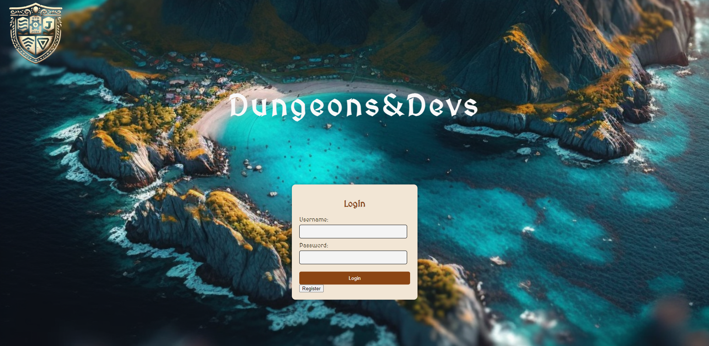

# `Dungeons&Devs`

**Welcome** to **DungeonsAndDevs** 🏰👨‍💻, where coding and fantasy merge in an epic learning adventure.


## Mockups🎨

Here's a sneak peek at what awaits you in Dungeons & Devs:


*Login pop-up with an island background.*


*Dashboard page featuring islands, water, and a rowboat.*


## Table of Contents
. [Team Members](#team-members)
. [User Story](#user-story)
. [Features](#features)
. [How to Use](#how-to-use)
. [Mockups](#mockups)
. [Getting Started](#getting-started)
. [Contributing](#contributing)
. [License](#license)
. [Contact](#contact)


## Team Members🧑‍💻

- `Sam Greenwood`:🎨🔧
Presentation & Design, Backend & Frontend Development, Interactive Map Design, Story Content Creation
- `Gurvir Singh`:🔧 
Backend Development, Database Connectivity, Debugging & Testing
- `Emilia Stewart`:🎨
Frontend Development, Research, Documentation
- `Max Bosch`:🎨🔧🔧
 Project Conceptualization, Lead Developer, Backend Development, Database Design, Debugging & Testing, Frontend Design

## User Story📖

```text
AS A STUDENT new to coding and development
I WANT a fun way to learn about coding and then test what I have retained

AS A PERSON who loves fantasy and gaming 
I WANT to participate in themed quests and collect fantasy items along the way that celebrate my successes

AS A STUDENT it is important to be able to track my progress
I WANT to track my progress as I go along as well as save my “CAMPAIGN” so I can return to my results
```
## Features✨

- `Interactive Learning` 🎮: Engage in coding challenges and quizzes within a captivating fantasy-themed environment.
- `Progress Tracking`: Monitor your learning journey with detailed progress tracking and the ability to save and resume your campaign.
- `Fantasy Rewards`: Earn fantasy items and achievements as you advance through your coding quests.

## How to Use🚀

1. `Registration`: Start by registering an account from the Dungeons & Devs login page.
2. `Dashboard Access`: Upon registration, access the main dashboard to navigate through the learning journey.
3. `Embark on Quests`: Interact with elements like rowboats and islands to unlock coding challenges and quizzes.
4. `Test Your Knowledge: Begin quizzes to test and reinforce your coding knowledge.


## Getting Started🛠️

To get started with DungeonsAndDevs, you'll need to clone the repository and install its dependencies. Follow these steps:

```bash
# Clone the repository
git clone https://github.com/Maximilian93B/DungeonsAndDevs.git

# Navigate into the project directory
cd DungeonsAndDevs

# Install dependencies
npm install

# Navigate to Develop/db/seeds to run seed files 
node index.js 

# You will require a MySQL Databse and add a .env to the project 
MySQL 
.env 

```

## Contributing🤝

Contributions are what make the open-source community such an amazing place to learn, inspire, and create. Any contributions you make are **greatly appreciated**.

If you have a suggestion that would make this better, please fork the repo and create a pull request. You can also simply open an issue with the tag "enhancement". Don't forget to give the project a star! Thanks again!

1. Fork the Project
2. Create your Feature Branch (`git checkout -b feature/AmazingFeature`)
3. Commit your Changes (`git commit -m 'Add some AmazingFeature'`)
4. Push to the Branch (`git push origin feature/AmazingFeature`)
5. Open a Pull Request

## License🔒

Distributed under the MIT License. See `LICENSE` for more information.

## Contact📬

Project Link: [https://github.com/Maximilian93B/DungeonsAndDevs]


**We welcome contributions to DungeonsAndDevs!** 

[🔝 Back to Top](#table-of-contents)


